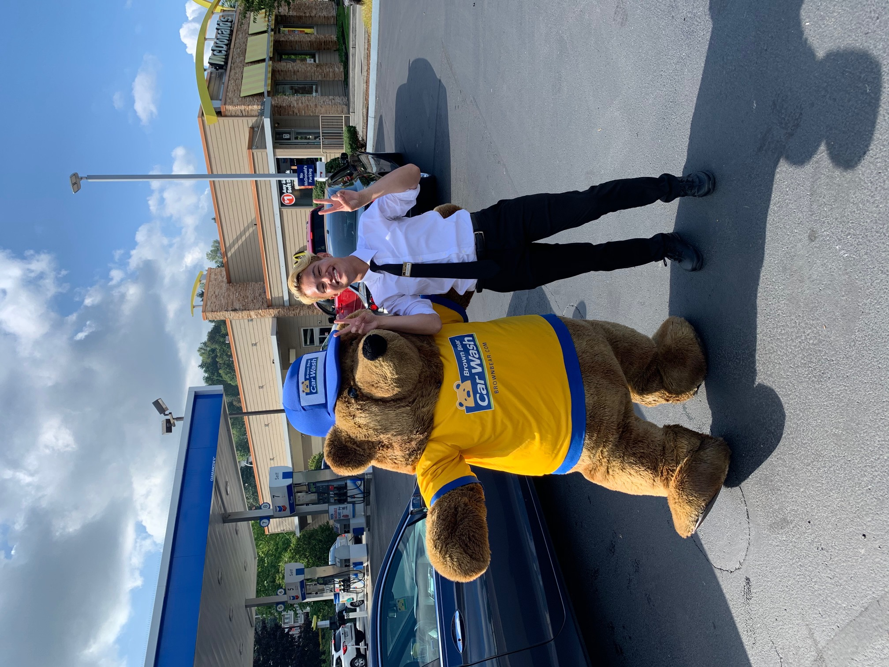

# Zulkifli Sales

zsales@uw.edu

https://www.linkedin.com/in/zulkifli-sales-3972261ba/

## Summary

Exceptional customer service and decision-making skills, with strong work ethic and quick learning ability. Extroverted, open-minded, and a creative thinker. Open to learning new tasks and procedures with a ready to get started mindset. Current full-time student at the University of Washington majoring in the GIS field with a minor in Informatics.

## Work Experience (only last 10 years)

### Brown Bear Car Wash (Renton, WA)

* February 2019 - Current
* **Current Position:** *PIC (Person-in-Charge), Shift-Lead*
* My role at my workplace was a shift lead and back-up assistant manager. I help consistently push 300-800 cars per day and make sure my crew is taken care of and also make it a point to make the customers feel welcome and appreciated for their time.

### University of Washington (Seattle, WA)

* [University of Washington](https://www.washington.edu/)
* Mascot: **Huskies**
> "The University of Washington climbed one spot to No. 7 on the U.S. News & World Report’s Best Global Universities rankings, released on Oct. 26. The UW maintained its No. 2 ranking among U.S. public institutions."
    - [Jackson Holtz (UW News)](https://www.washington.edu/news/2021/10/26/uw-rises-to-no-7-in-us-news-best-global-universities-ranking/)

**Undergraduate Student** 
*(Major: Geography: Data Science, Minor: Informatics)* 
(Sept 2019 - June 2022)

Full time student, *Majoring in Geography: Data Science and Minor in Informatics.* Currently 3rd year senior at the university and graduating this **Spring 2022**

- **Deans List Spring 2021 - Spring 2022**
- **Major/Technology Chair in EverybodyHacks UW**
    - *Lead a team to write emails, contact panelist and distribute work among team members to contribute to the success of the final hackathon.*
- **Cumulative GPA:** *3.34*
- **Major GPA:** *3.92*

### South Seattle Community College (Seattle, WA)

* [South Seattle College](https://southseattle.edu/) 
* One of the three Seattle college campuses
* Mascot: **Otters**

**Running Start Student** 
(Sept 2017 - August 2020) (Associates of Arts Degree)

Junior year of high school, running start student at South Seattle Community College. Taking 3 courses each quarter to fulfill both high school and college AA requirements.

- **Cumulative GPA:** *3.07*
- **Associates of Arts Degree:** *August 2020*
- **High school and college student**